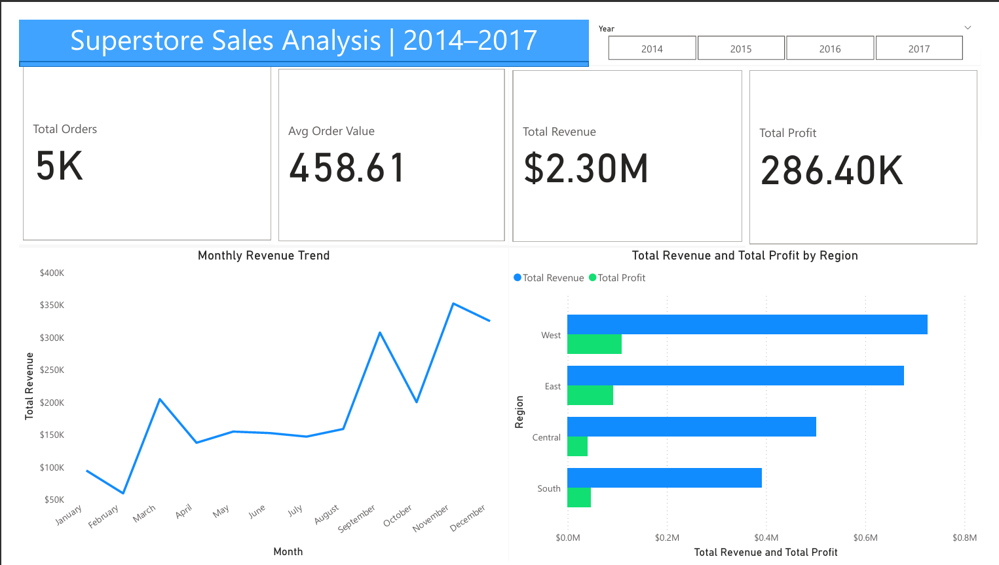
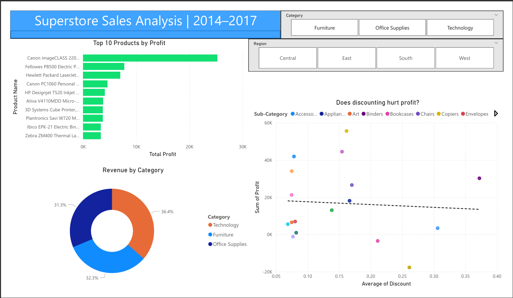

# Superstore Sales Dashboard — Power BI

## Project Overview
An interactive 2-page Power BI dashboard analyzing 9,994 orders from the 
Sample Superstore dataset (2014–2017), covering $2.3M in revenue across 
4 regions and 3 product categories. The dashboard enables business users 
to explore sales performance, profit trends, and the impact of discounting 
through dynamic slicers and visual analytics.

---

## Dashboard Screenshots

### Page 1 — Overview

### Page 2 — Product Analysis

---

## Business Questions Answered

1. Which region generates the highest revenue and profit?
2. Which months show peak and low sales performance?
3. Which product categories and sub-categories are most profitable?
4. Do higher discounts negatively impact profit margins?
5. What are the top 10 most profitable products in the store?

---

## Key Insights

- **West region leads in total sales** ($725K) but East region shows 
  stronger profit margins relative to revenue generated.
- **Technology category drives the highest profit** despite Office Supplies 
  having more orders — proving that volume alone doesn't equal profitability.
- **Discounts above 20% consistently produce negative or near-zero profit** 
  across all sub-categories, clearly visible in the scatter plot trend line.

---

## Tools Used

| Tool | Purpose |
|------|---------|
| Power BI Desktop | Dashboard building and visualizations |
| DAX | Custom measures (Revenue, Profit Margin, Avg Order Value) |
| Power Query | Data cleaning and type formatting |
| Excel / CSV | Source data preparation |

---

## Dataset
- **Source:** Sample Superstore Dataset
- **Records:** 9,994 orders
- **Period:** 2014–2017
- **Fields:** Order Date, Region, Category, Sub-Category, 
  Sales, Profit, Discount, Quantity

---

## How to Use
1. Download the `.pbix` file from this repository
2. Open in Power BI Desktop
3. Use the Year, Region, and Category slicers to filter the dashboard
4. Switch between Overview and Product Analysis pages using 
   the tabs at the bottom
